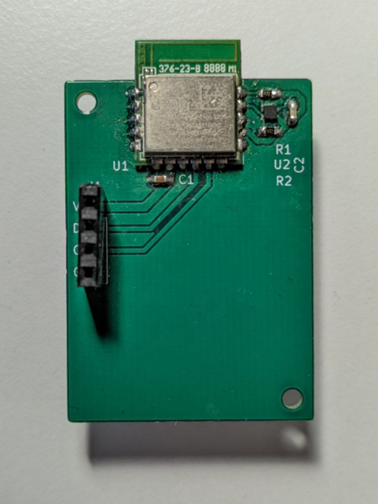

# BLE Weather Station

The BLE Weather Station is a project I started in late 2022 as a way to get practical experience with developing low-power IoT solutions.

## Working principle
The weather station consists of two main components: a central device serving as the station, and a peripheral device serving as a temperature node.

### Peripheral device

The peripheral device consists of a Renesas DA14531 BLE module together with a STS40 temperature sensor. The peripheral device performs a temperature reading every 10min, and includes this reading in its advertisement data. The BLE module is set to advertise with an interval of 1s.  
The peripheral is powered with a CR2450 cell-battery. In order to minimize current consumption, non-connectable advertisements are used together with extended sleep which is entered between advertisement. With this configuration, estimations done with a power analyzer results in a battery life of ~4 years. 

### Central device

The main components of the central device is a Renesas DA14531 BLE module, BME680 environmental sensor, and a 4.2" E-Paper display. The central device spends most of its time in deep sleep, but wakes up every 30min to performs its task. After waking up, the central device starts scanning for the peripheral device. If the peripheral device is detected, the central reads the peripherals temperature from the advertisement data. If the peripheral cant be detected within 15s, the temperature value is set to 255. After the peripheral temperature is set, the central device performs a reading from the BME680 sensor (temperature, humidity, air-pressure, gas-resistance). So, at this point, the central has acquired 5 data values:

&nbsp;&nbsp;&nbsp;&nbsp;1. Peripheral temperature  
&nbsp;&nbsp;&nbsp;&nbsp;2. Central temperature  
&nbsp;&nbsp;&nbsp;&nbsp;3. Central humidity  
&nbsp;&nbsp;&nbsp;&nbsp;4. Central air-pressure  
&nbsp;&nbsp;&nbsp;&nbsp;5. Central gas resistance 

These values are then displayed on the E-Paper display, after which the central goes back to sleep.

## Current status
The project has reached the point where it is functioning as intended, but still has some unfinished tasks:

* Designing and 3D-printing enclosures for both the peripheral and the central.
* Calibrating the BME680's gas resistance reading and converting it into an air quality grade.
* Performing current consumption measurements on the central.

